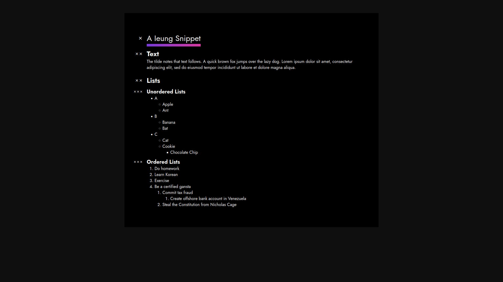

# 이응 (Ieung)
## Introduction
When at the start of words, the Korean ```ㅇ``` symbol is silent.

Similar to markdown, Ieung intends to be human readable, powerful in capability, and be visually similar 
to a normal text file. It strives to get out of your way, and in a sense, be silent.

Every line in Ieung has a left-aligned type identifier for the first two characters, followed by an empty space.
This makes parsing files significantly easier, and also ensures that .ng files (the default file extention) are cool to look at.

The following is a short snippet of Ieung:
```Ieung
x  A Ieung Snippet
@  example test
#  this is a lovely comment

xx Text
~  The tilde notes that text follows.
~  A quick brown fox jumps over the lazy dog.
~  Lorem ipsum dolor sit amet, consectetur adipiscing elit, sed do eiusmod tempor incididunt ut labore et dolore magna aliqua.

xx Lists
x3 Unordered Lists
.  A
.2 Apple
.2 Ant
.  B
.2 Banana
.2 Bat
.  C
.2 Cat
.2 Cookie
.3 Chocolate Chip

x3 Ordered Lists
-  Do homework
-  Learn Korean
-  Exercise
-  Be a certified gansta
-2 Commit tax fraud
-3 Create offshore bank account in Venezuela
-2 Steal the Constitution from Nicholas Cage
```
The relevant HTML output can be observed by running ```make && make run```.

## Example output


## Features
- [x] Titles
- [x] Tags
- [x] Comments
- [x] Lists
- [ ] Code snippets
